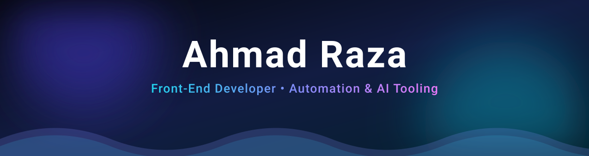

<div align="center">



<a href="https://github.com/ahmad2422">
  
</a>

<br />

<a href="https://ahmad-portfolio-plum.vercel.app/"></a>
<a href="https://www.linkedin.com/in/ahmad-raza-41a68a229/"></a>
<a href="mailto:ahmedraza43210@gmail.com"></a>
<a href="https://github.com/ahmad2422?tab=followers"></a>
<a href="https://github.com/ahmad2422?tab=repositories"></a>

<br /><br />

</div>



### 👋 About me

```ts
const ahmad = {
  role:      "Front-End Developer",
  location:  "Pakistan 🇵🇰",
  focus:     ["web interfaces", "developer tooling", "automation & AI agents"],
  languages: ["JavaScript", "TypeScript", "Node.js", "PHP", "C", "C++", "Rust"],
  styling:   ["CSS3", "Tailwind CSS", "Sass", "Bootstrap"],
  currently: ["shipping side projects", "contributing to open source"],
  contact:   "ahmedraza43210@gmail.com",
  askMeAbout:["React / Next.js", "automation scripts", "AI agent workflows"],
} as const;
```

- 🔭 I build **fast, accessible front-ends** and the **automation around them** — from CI scripts to agent-powered workflows.
- 🌱 Deep-diving into **Rust**, **systems programming in C/C++**, and **PHP** back-ends to round out the stack.
- 🧩 I like projects that remove friction for other developers: gateways, harnesses, design systems, CLI tooling.
- 🤝 Open to collaboration on **open-source tooling, front-end libraries, and automation**. Issues and PRs welcome.


### 🧰 Tech Stack

<div align="center">

**Languages & Runtimes**

<a href="https://developer.mozilla.org/en-US/docs/Web/JavaScript" title="JavaScript"></a>
<a href="https://www.typescriptlang.org" title="TypeScript"></a>
<a href="https://nodejs.org" title="Node.js"></a>
<a href="https://www.php.net" title="PHP"></a>
<a href="https://en.cppreference.com/w/c" title="C"></a>
<a href="https://isocpp.org" title="C++"></a>
<a href="https://www.rust-lang.org" title="Rust"></a>

**Front-end & Design**

<a href="https://developer.mozilla.org/en-US/docs/Web/HTML" title="HTML5"></a>
<a href="https://developer.mozilla.org/en-US/docs/Web/CSS" title="CSS3"></a>
<a href="https://sass-lang.com" title="Sass"></a>
<a href="https://tailwindcss.com" title="Tailwind CSS"></a>
<a href="https://getbootstrap.com" title="Bootstrap"></a>
<a href="https://mui.com" title="Material UI"></a>
<a href="https://www.figma.com" title="Figma"></a>

**Libraries & Frameworks**

<a href="https://react.dev" title="React"></a>
<a href="https://nextjs.org" title="Next.js"></a>
<a href="https://vuejs.org" title="Vue.js"></a>
<a href="https://svelte.dev" title="Svelte"></a>
<a href="https://expressjs.com" title="Express"></a>
<a href="https://threejs.org" title="Three.js"></a>
<a href="https://jquery.com" title="jQuery"></a>
<a href="https://vite.dev" title="Vite"></a>
<a href="https://pnpm.io" title="pnpm"></a>
<a href="https://motion.dev" title="Framer Motion"></a>
<a href="https://gsap.com" title="GSAP"></a>

**Data, DevOps & Tooling**

<a href="https://www.mongodb.com" title="MongoDB"></a>
<a href="https://www.mysql.com" title="MySQL"></a>
<a href="https://redis.io" title="Redis"></a>
<a href="https://git-scm.com" title="Git"></a>
<a href="https://github.com" title="GitHub"></a>
<a href="https://www.docker.com" title="Docker"></a>
<a href="https://www.kernel.org" title="Linux"></a>
<a href="https://vercel.com" title="Vercel"></a>
<a href="https://code.visualstudio.com" title="VS Code"></a>
<a href="https://www.gnu.org/software/bash" title="Bash"></a>
<a href="https://github.com/features/actions" title="GitHub Actions"></a>

**AI & Automation**

<a href="https://openai.com" title="OpenAI"></a>
<a href="https://claude.ai" title="Claude"></a>
<a href="https://modelcontextprotocol.io" title="Model Context Protocol"></a>
<a href="https://ollama.com" title="Ollama"></a>
<a href="https://python.org" title="Python"></a>

</div>


### 🚀 What I'm exploring right now

| Project | Why it's on my radar |
| :--- | :--- |
| [**openclaw/openclaw**](https://github.com/openclaw/openclaw) | The open personal-agent platform — "the AI that really does things". Studying how agents are wired to real machines. |
| [**NousResearch/hermes-agent**](https://github.com/NousResearch/hermes-agent) | An agent that grows with you: skills, memory and self-improvement patterns worth learning from. |
| [**diegosouzapw/OmniRoute**](https://github.com/diegosouzapw/OmniRoute) | One endpoint, hundreds of providers — the routing/fallback architecture I want to reuse in my own tooling. |
| [**pbakaus/impeccable**](https://github.com/pbakaus/impeccable) | A design language that makes AI output look intentional. Exactly where front-end meets agents. |


### 🍴 Open source I'm tracking & contributing to

> A curated index of the forks I'm reading and contributing to — the ones where I can add the most value are marked ⭐.

**AI agents, harnesses & orchestration**
[openclaw](https://github.com/ahmad2422/openclaw) · [hermes-agent](https://github.com/ahmad2422/hermes-agent) · [ECC](https://github.com/ahmad2422/ECC) · [goose](https://github.com/ahmad2422/goose) · [zeroclaw](https://github.com/ahmad2422/zeroclaw) · [herdr](https://github.com/ahmad2422/herdr) · [claude-mem](https://github.com/ahmad2422/claude-mem) · [ponytail](https://github.com/ahmad2422/ponytail) · [ruflo](https://github.com/ahmad2422/ruflo) · [orca](https://github.com/ahmad2422/orca) · [AionUi](https://github.com/ahmad2422/AionUi) · [dify](https://github.com/ahmad2422/dify)

**LLM tooling, MCP & knowledge**
[context7](https://github.com/ahmad2422/context7) · [chrome-devtools-mcp](https://github.com/ahmad2422/chrome-devtools-mcp) · [graphify](https://github.com/ahmad2422/graphify) · [gemini-cli](https://github.com/ahmad2422/gemini-cli) · [OmniRoute](https://github.com/ahmad2422/OmniRoute)

**Web, design & front-end**
⭐ [airi](https://github.com/ahmad2422/airi) · ⭐ [archify](https://github.com/ahmad2422/archify) · [impeccable](https://github.com/ahmad2422/impeccable) · [hyperframes](https://github.com/ahmad2422/hyperframes) · [Front-End-Checklist](https://github.com/ahmad2422/Front-End-Checklist) · [tailwindcss](https://github.com/ahmad2422/tailwindcss) · [vite](https://github.com/ahmad2422/vite)

**Systems & performance — C/C++ · Rust**
⭐ [mimiclaw](https://github.com/ahmad2422/mimiclaw) · ⭐ [cc-switch](https://github.com/ahmad2422/cc-switch) · [llama.cpp](https://github.com/ahmad2422/llama.cpp) · [terminal](https://github.com/ahmad2422/terminal) · [meilisearch](https://github.com/ahmad2422/meilisearch)

**PHP & marketing automation**
[mautic](https://github.com/ahmad2422/mautic)

**Community knowledge bases**
[awesome-openclaw-skills](https://github.com/ahmad2422/awesome-openclaw-skills) · [awesome-openclaw-usecases](https://github.com/ahmad2422/awesome-openclaw-usecases)


### 📊 GitHub in numbers

<div align="center">
  
</div>

<div align="center">
  <picture>
    <source media="(prefers-color-scheme: dark)" srcset="https://raw.githubusercontent.com/ahmad2422/ahmad2422/output/github-snake-dark.svg" />
    <source media="(prefers-color-scheme: light)" srcset="https://raw.githubusercontent.com/ahmad2422/ahmad2422/output/github-snake.svg" />
    
  </picture>
</div>


### 🗂️ Selected work

| Project | Stack | What it is |
| :--- | :--- | :--- |
| [**Ahmad-Portfolio**](https://github.com/ahmad2422/Ahmad-Portfolio) | `TypeScript` `Next.js` `Tailwind` | My personal portfolio — [live site](https://ahmad-portfolio-plum.vercel.app/) |
| [**Youtube-skin-code**](https://github.com/ahmad2422/Youtube-skin-code) | `HTML` `CSS` `JS` | A custom YouTube player shell — poster cover, brandable play button, keyboard accessible. GPL-3.0. |


<div align="center">

### 🤝 Let's build something

I'm always up for collaborating on **front-end libraries, developer tooling, and automation**.
If something in my repos catches your eye — open an issue, send a PR, or just say hi.

<a href="https://github.com/ahmad2422"></a>
<a href="https://www.linkedin.com/in/ahmad-raza-41a68a229/"></a>
<a href="mailto:ahmedraza43210@gmail.com"></a>
<a href="https://ahmad-portfolio-plum.vercel.app/"></a>

<br /><br />


<sub><i>"Always learning and creating cool project stuffs."</i></sub>

</div>
