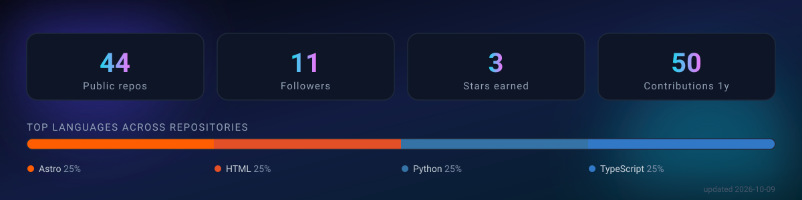

<!-- Design preview only. README.md remains the live profile. -->

  

  <a href="https://ahmad-portfolio-plum.vercel.app/"><strong>Visit my portfolio ↗</strong></a>
  &nbsp; / &nbsp;
  <a href="https://www.linkedin.com/in/ahmad-raza-41a68a229/">LinkedIn</a>
  &nbsp; / &nbsp;
  <a href="mailto:ahmedraza43210@gmail.com">Get in touch</a>

<a href="#selected-work">SELECTED WORK</a> &nbsp; · &nbsp; <a href="#toolkit">TOOLKIT</a> &nbsp; · &nbsp; <a href="#exploration">EXPLORATION</a> &nbsp; · &nbsp; <a href="#activity">ACTIVITY</a>

 

## A little design. A lot of curiosity.

I'm **Ahmad**, a front-end developer in Pakistan interested in the space between **interfaces, developer tools, and automation**. I like understanding how things work—and finding ways to make them easier to use.

My focus is the web. My next chapter reaches further: **Node.js and PHP back-ends, Rust and C/C++ systems, and practical AI-agent workflows.**

> **What interests me:** interfaces that feel considered, tools that save time, and open-source projects I can learn from and eventually contribute to.

 

## 01 / Selected work

**Start with what I've built.**

<table>
<tr>
<td width="50%" valign="top">
<h3>Ahmad Portfolio ↗</h3>

A home for my work, interests, and next experiments.

<code>TypeScript</code> <code>Next.js</code> <code>Tailwind CSS</code>

<a href="https://ahmad-portfolio-plum.vercel.app/"><strong>Visit the site →</strong></a> &nbsp; <a href="https://github.com/ahmad2422/Ahmad-Portfolio">View source</a>

</td>
<td width="50%" valign="top">
<h3>YouTube Player Shell ↗</h3>

A custom interface around a YouTube embed: poster cover, styled controls, and a brandable play button.

<code>HTML</code> <code>CSS</code> <code>JavaScript</code>

<a href="https://github.com/ahmad2422/Youtube-skin-code"><strong>Explore the project →</strong></a>

</td>
</tr>
</table>

 

## 02 / Toolkit

**The technologies I use, study, and experiment with.** Each icon opens its documentation or official site—not a claim of equal expertise in every tool.

#### Languages & runtimes

&nbsp;
&nbsp;
&nbsp;
&nbsp;
&nbsp;
&nbsp;

#### Interfaces & design

&nbsp;
&nbsp;
&nbsp;
&nbsp;
&nbsp;
&nbsp;

#### Tools & AI workflows

&nbsp;
&nbsp;
&nbsp;
&nbsp;
&nbsp;
&nbsp;

<strong>More of the toolkit</strong> — libraries, styling, and infrastructure

 

&nbsp;
&nbsp;
&nbsp;
&nbsp;
&nbsp;

[Motion](https://motion.dev/) · [Zustand](https://zustand.docs.pmnd.rs/) · [jQuery](https://jquery.com/) · [Express](https://expressjs.com/) · [Vite](https://vite.dev/) · [pnpm](https://pnpm.io/)  
[MongoDB](https://www.mongodb.com/) · [MySQL](https://www.mysql.com/) · [Redis](https://redis.io/) · [Linux](https://www.kernel.org/) · [Vercel](https://vercel.com/) · [Python](https://www.python.org/) · [Bash](https://www.gnu.org/software/bash/)

 

## 03 / Following the interesting problems

Four projects at the intersection of what I want to understand next.

| Project | What I'm interested in |
| :--- | :--- |
| **[OpenClaw ↗](https://github.com/openclaw/openclaw)** | Connecting personal agents to useful, real-world actions. |
| **[Hermes Agent ↗](https://github.com/NousResearch/hermes-agent)** | How memory, reusable skills, and agent workflows fit together. |
| **[OmniRoute ↗](https://github.com/diegosouzapw/OmniRoute)** | Routing requests between model providers and handling fallbacks. |
| **[Impeccable ↗](https://github.com/pbakaus/impeccable)** | Giving AI-assisted interfaces a more intentional design language. |

<strong>Open-source reading list</strong> — more projects I'm tracking

These are exploration targets and forks, not a list of contributions already made.

**Agents & orchestration**  
[goose](https://github.com/ahmad2422/goose) · [zeroclaw](https://github.com/ahmad2422/zeroclaw) · [dify](https://github.com/ahmad2422/dify) · [claude-mem](https://github.com/ahmad2422/claude-mem) · [ruflo](https://github.com/ahmad2422/ruflo)

**Developer experience**  
[context7](https://github.com/ahmad2422/context7) · [chrome-devtools-mcp](https://github.com/ahmad2422/chrome-devtools-mcp) · [gemini-cli](https://github.com/ahmad2422/gemini-cli) · [cc-switch](https://github.com/ahmad2422/cc-switch)

**Interfaces & the web**  
[airi](https://github.com/ahmad2422/airi) · [archify](https://github.com/ahmad2422/archify) · [tailwindcss](https://github.com/ahmad2422/tailwindcss) · [vite](https://github.com/ahmad2422/vite)

**Systems & automation**  
[llama.cpp](https://github.com/ahmad2422/llama.cpp) · [mimiclaw](https://github.com/ahmad2422/mimiclaw) · [meilisearch](https://github.com/ahmad2422/meilisearch) · [mautic](https://github.com/ahmad2422/mautic)

[Browse all repositories →](https://github.com/ahmad2422?tab=repositories)

 

## 04 / GitHub in numbers

Generated snapshots stored in this repository. Repository totals include forks; the language bar counts repositories, not proficiency or lines of code.

<strong>A little motion</strong> — the contribution snake

<picture>
<source media="(prefers-color-scheme: dark)" srcset="https://raw.githubusercontent.com/ahmad2422/ahmad2422/output/github-snake-dark.svg" />

</picture>

 

---

### Have something worth building?

A front-end experiment, a useful developer tool, or a better way to automate the everyday—I'd like to hear about it.

**[Let's talk →](mailto:ahmedraza43210@gmail.com)** &nbsp; · &nbsp; [LinkedIn](https://www.linkedin.com/in/ahmad-raza-41a68a229/) &nbsp; · &nbsp; [Portfolio](https://ahmad-portfolio-plum.vercel.app/)

 

Ahmad Raza &nbsp; / &nbsp; Building, learning, iterating.

